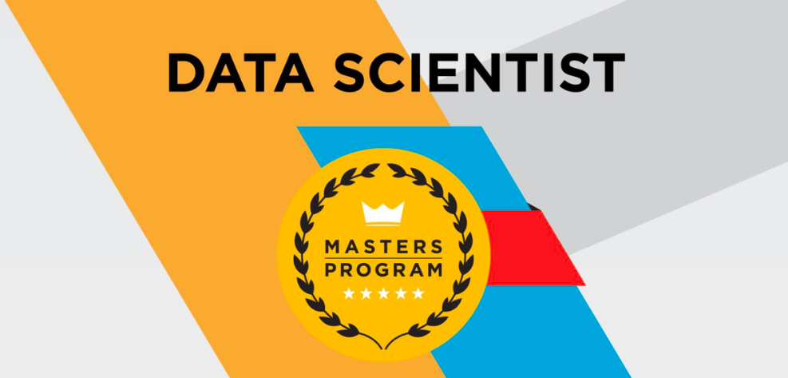

# Simplilearn - Data Scientist Master Program

# Courses of Data Scientist Master Programs

1. [Data Science Certification Training - R Programming]()

2. [Data Science with Python]()

3. [Machine Learning]()

4. [Tableau Training]()

5. [Big Data Hadoop and Spark Developer]()

6. [Data Science Capstone]()

## Certificate Verification

[Verifiy Certificate](https://storage.googleapis.com/devendra-bucket-1/Certificates/20%20Data%20Science%20Master.pdf)
