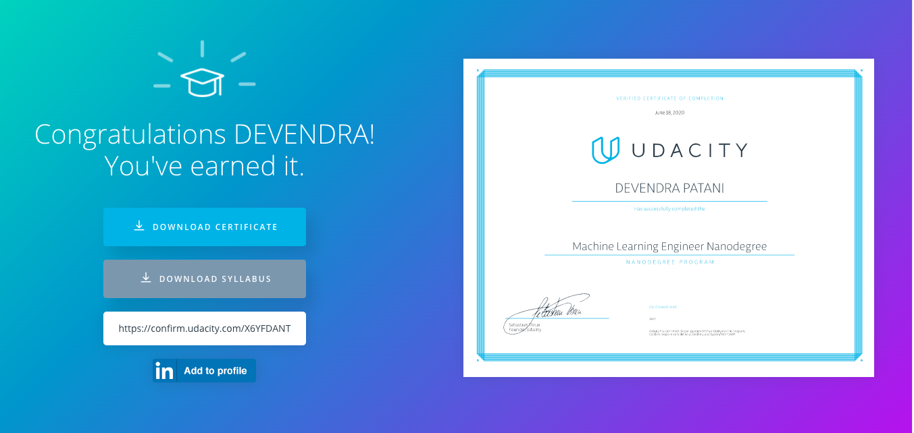

# Udacity - Machine Learning Engineer Nanodegree

# Projects of Machine Learning Engineer

1. [Build a Python Package]()

2. [Deploy a Sentiment Analysis Model: Using SageMaker and Pytorch]()

3. [Deploy Plagiarism detection model using Amazon SageMaker]()

4. [Capstone Project & Proposal]()

## Certificate Verification

[Verifiy Certificate](https://confirm.udacity.com/X6YFDANT)
